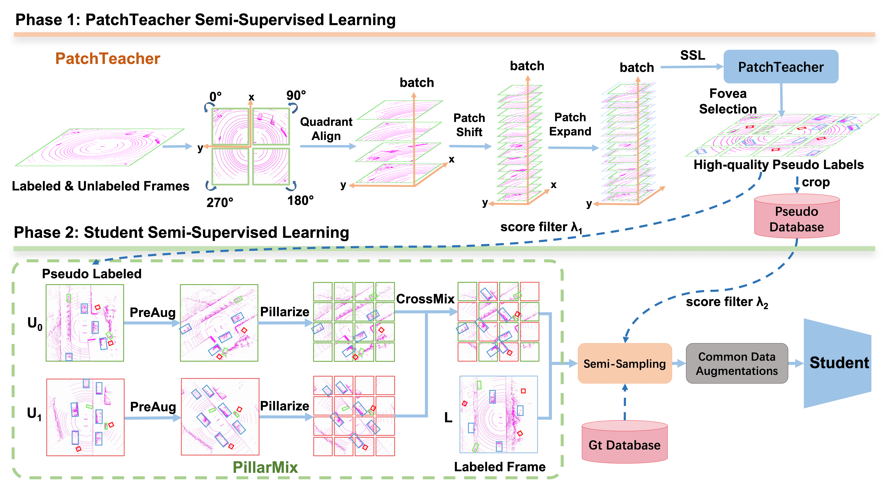

# Semi-supervised 3D Object Detection with PatchTeacher and PillarMix (AAAI 2024)
<p align="center">  </p>

This is the official implementation of [**Semi-supervised 3D Object Detection with PatchTeacher and PillarMix (AAAI 2024)**](https://arxiv.org/abs/2407.09787), built on [`OpenPCDet`](https://github.com/open-mmlab/OpenPCDet)

## Installation
Please refer to [INSTALL.md](docs/INSTALL.md) for the installation of `OpenPCDet`.

## Quick Demo
Please refer to [DEMO.md](docs/DEMO.md) for a quick demo to test with a pretrained model and 
visualize the predicted results on your custom data or the original KITTI data.

## Getting Started
Please refer to [GETTING_STARTED.md](docs/GETTING_STARTED.md) to learn more usage about this project.

## Training PTPM on Waymo Open DataSet
Please refer to [PTPM_WAYMO.md](docs/PTPM_WAYMO.md) to train our method on Waymo Open Dataset.

## Training PTPM on ONCE DataSet
Please refer to [PTPM_ONCE.md](docs/PTPM_ONCE.md) to train our method on ONCE Dataset.

## Citation 
If you find this project useful in your research, please consider cite:
```
@inproceedings{wu2024semi,
  title={Semi-supervised 3D Object Detection with PatchTeacher and PillarMix},
  author={Wu, Xiaopei and Peng, Liang and Xie, Liang and Hou, Yuenan and Lin, Binbin and Huang, Xiaoshui and Liu, Haifeng and Cai, Deng and Ouyang, Wanli},
  booktitle={Proceedings of the AAAI Conference on Artificial Intelligence},
  volume={38},
  number={6},
  pages={6153--6161},
  year={2024}
}
```